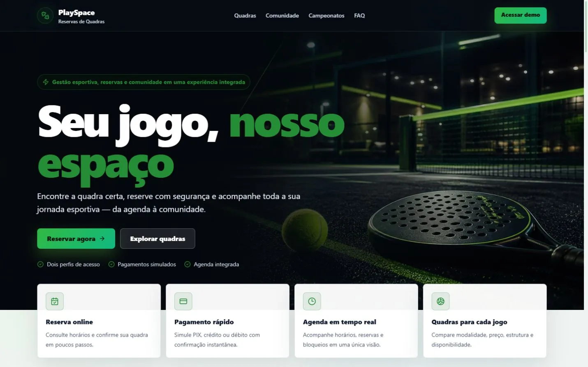
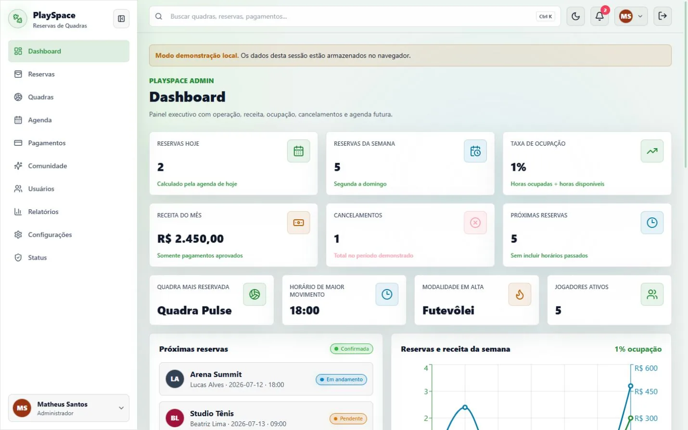
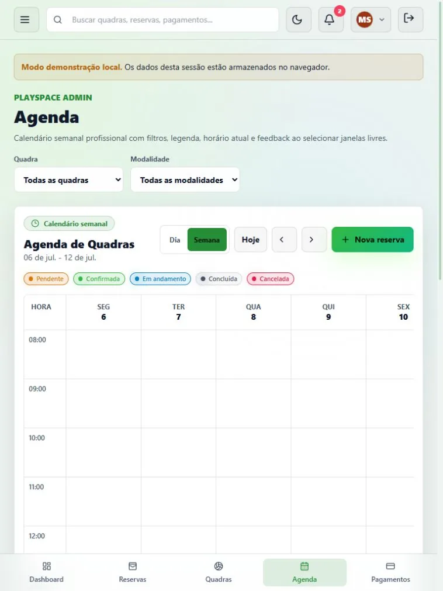

# PlaySpace — Reservas de Quadras

PlaySpace é uma plataforma full-stack de reservas e operação esportiva com dois perfis de acesso, agenda responsiva, pagamentos demonstrativos, comunidade e dashboards. O projeto combina acabamento visual de produto SaaS com regras de negócio protegidas no servidor, integração API-first e um modo demo claramente identificado.

## Visão do produto

### Operação administrativa

### Agenda responsiva

## Principais diferenciais

- Interface premium em temas claro e escuro, com identidade esportiva e verde como cor principal.
- 23 rotas autenticadas: 10 administrativas e 13 para clientes.
- Agenda semanal no desktop/tablet e visualização diária automática no mobile.
- Disponibilidade consultada no servidor para cada período visível; slots de outros clientes são enviados sem identidade, preço ou observações, e a reserva fica bloqueada se a verificação falhar.
- Criação concorrente de reservas protegida por lock pessimista e conflito transacional.
- Preço, capacidade, janela de funcionamento e transições de status validados pelo backend.
- Pagamento demo controlado pelo servidor; aprovação confirma a reserva e cancelamento invalida pagamentos vinculados.
- Sessão race-safe: respostas antigas não sobrescrevem uma conta mais recente.
- Coleções operacionais da API não são persistidas entre contas; a chave de sessão guarda apenas token/usuário atual, enquanto preferências guardam tema e tour.
- Comunidade, ranking, conquistas, avaliações, campeonatos, notificações e assistente integrados à API quando disponível.
- Flyway como fonte do schema, Hibernate em modo <code>validate</code> e índices para os fluxos críticos.
- Rotas divididas em chunks e imagens WebP locais com carregamento otimizado.
- Quality gate no GitHub Actions para testes/builds do frontend e backend, validação do Compose e construção das imagens.

## Funcionalidades

### Experiência pública

- Landing page com hero, benefícios, métricas identificadas como demonstração, galeria de seis quadras, comunidade, campeonatos, depoimentos, FAQ em accordion e rodapé.
- Imagens locais por modalidade, recorte padronizado, <code>object-fit</code>, lazy loading, texto alternativo e fallback.
- Login em duas colunas com preenchimento demo, exibir/ocultar senha, aviso de Caps Lock, Enter, loading, bloqueio de duplo envio e erro amigável.
- Páginas próprias para 403, 404, 500, offline e manutenção.

### Administrador

| Rota | Entrega |
| --- | --- |
| <code>/admin</code> | KPIs calculados, próximas reservas, gráfico com dois eixos, rosca por status, modalidades, horários e atividade da API sem misturar o seed demo |
| <code>/admin/reservas</code> | Busca, filtros, paginação, detalhes, histórico, pagamento e cancelamento confirmado |
| <code>/admin/quadras</code> | Cadastro, edição, imagem, status, preço, capacidade e arquivamento lógico |
| <code>/admin/agenda</code> | Calendário, filtros por quadra/modalidade, seleção de horário e nova reserva |
| <code>/admin/pagamentos</code> | Histórico, busca, status, método e transações |
| <code>/admin/comunidade</code> | Feed, avaliações e campeonatos com dados remotos quando disponíveis |
| <code>/admin/usuarios</code> | Cadastro, edição, avatar, perfil, senha provisória forte e ativação/inativação |
| <code>/admin/relatorios</code> | Indicadores derivados, impressão/PDF pelo navegador, exportação XLS compatível e CSV |
| <code>/admin/configuracoes</code> | Leitura da API e ajustes locais de empresa, horários, regras e preços |
| <code>/admin/status</code> | Estado técnico sem exposição de hosts ou credenciais |

### Cliente

| Rota | Entrega |
| --- | --- |
| <code>/app</code> | Resumo esportivo, clima identificado como simulado, próximas reservas e conquistas |
| <code>/app/reservas</code> | Próximas partidas, histórico, detalhes, pagamento e cancelamento |
| <code>/app/nova-reserva</code> | Fluxo guiado que verifica a data escolhida na API antes de anunciar disponibilidade, com cálculo de valor e pagamento demo |
| <code>/app/quadras</code> | Busca, favoritos, disponibilidade, estrutura, nota e preço |
| <code>/app/agenda</code> | Horários ocupados sem expor dados de outros jogadores |
| <code>/app/pagamentos</code> | Histórico e filtros de transações |
| <code>/app/perfil</code> | Perfil esportivo, bio, cidade, modalidades, nível e conquistas |
| <code>/app/estatisticas</code> | Reservas, horas, gastos, frequência e evolução |
| <code>/app/comunidade</code> | Feed integrado, curtidas remotas e comentários explicitamente demo |
| <code>/app/ranking</code> | Ranking remoto por horas, reservas e comparecimento |
| <code>/app/parceiros</code> | Busca e criação local de anúncio claramente marcada como simulação |
| <code>/app/campeonatos</code> | Informações, chaveamento e inscrição via API |
| <code>/app/ai</code> | Assistente demonstrativo baseado em regras e dados internos |

### UX transversal

- Sidebar expansível no desktop e drawer no mobile, com preferência local.
- Navegação inferior responsiva para as ações mais frequentes.
- Busca global funcional, agrupada por entidade, com atalho <code>Ctrl + K</code> ou <code>/</code>.
- Menu de perfil com troca real entre conta administrativa e cliente.
- Central de notificações com contador, leitura, limpeza, Escape e clique externo.
- Modal global em portal, centralizado, com foco inicial, trap de foco, Escape, restauração de foco e bloqueio de scroll.
- Inputs com ícone reutilizáveis, sem sobreposição de placeholder.
- Tooltips acessíveis, estados vazios, mensagens de erro e confirmações destrutivas.
- Status semânticos consistentes em cards, tabelas, calendário e gráficos.

## Arquitetura

~~~mermaid
flowchart LR
    B["Navegador"] --> R["React + TypeScript + Vite"]
    R -->|"/api em desenvolvimento"| VP["Proxy do Vite"]
    R -->|"/api em Docker"| N["Nginx"]
    VP --> S["Spring Boot API"]
    N --> S
    S --> J["Spring Security + JWT"]
    S --> F["Flyway + JPA validate"]
    F --> P[("PostgreSQL")]
    R -. "falha de transporte/ambiente demo" .-> D["Estado demonstrativo em memória"]
~~~

O frontend tenta a API primeiro. A autenticação só cai para as credenciais locais quando a API está inacessível ou responde com falha de infraestrutura; credenciais rejeitadas não ativam o fallback. Módulos secundários usam carregamento resiliente, sem derrubar o núcleo se um endpoint opcional estiver indisponível.

## Regras de negócio e segurança

- Funcionamento entre 08:00 e 22:00 e duração mínima de 60 minutos.
- Reserva proibida no passado, acima da capacidade ou em quadra indisponível.
- Valor calculado exclusivamente pelo servidor conforme duração e preço/hora.
- Sobreposição bloqueada para <code>PENDENTE</code>, <code>CONFIRMADA</code> e <code>EM_ANDAMENTO</code>.
- Lock pessimista na quadra para serializar tentativas concorrentes.
- Cliente só cria, paga e cancela reservas próprias; cancelamento exige duas horas de antecedência.
- Máquina de estados validada no serviço de reservas.
- Pagamento aprovado duplicado bloqueado; status de aprovação não é confiado ao cliente.
- Cancelar reserva também cancela pagamentos pendentes ou aprovados na mesma transação.
- JWT validado a cada requisição, inclusive estado ativo/bloqueado do usuário.
- Respostas não autenticadas usam 401; falta de permissão usa 403; conflitos usam 409.
- Notificações protegidas contra IDOR.
- E-mail único sem diferenciar maiúsculas/minúsculas.
- Senha administrativa provisória exige tamanho, maiúscula, minúscula, número e símbolo.
- Autoinativação e remoção do último administrador ativo são bloqueadas.
- Exclusão de quadra é lógica e preserva o histórico.
- Auditoria persistida para login, usuários, quadras, reservas e pagamentos.
- DTOs mínimos nos endpoints de disponibilidade e comunidade evitam expor relações JPA ou dados privados.
- CORS e segredo JWT são configurados por ambiente.

## Stack

| Camada | Tecnologias |
| --- | --- |
| Frontend | React 18, TypeScript, Vite 6, React Router, Tailwind CSS, Recharts 3, Lucide |
| Backend | Java 21, Spring Boot 3.4, Spring Security, JWT/JJWT, Bean Validation, JPA/Hibernate |
| Dados | PostgreSQL 16, Flyway, H2 PostgreSQL mode nos testes |
| Infra | Docker, Docker Compose, Nginx |
| Testes | Vitest 4, Testing Library, JUnit 5, Spring Boot Test, MockMvc |
| CI | GitHub Actions com Node 22 e Temurin 21 |

## Credenciais de demonstração

| Perfil | E-mail | Senha |
| --- | --- | --- |
| Administrador | <code>admin@playspace.com</code> | <code>Admin@123</code> |
| Cliente | <code>cliente@playspace.com</code> | <code>Cliente@123</code> |

O seeder só é executado nos perfis <code>demo</code> e <code>test</code>.

## Execução com Docker

Pré-requisito: Docker Desktop com Docker Compose v2.

~~~powershell
Copy-Item .env.example .env
docker compose up --build
~~~

Em macOS/Linux:

~~~bash
cp .env.example .env
docker compose up --build
~~~

Acessos padrão:

- Frontend: http://localhost:3002
- API: http://localhost:28080
- Swagger: http://localhost:28080/swagger-ui.html
- PostgreSQL: acessível apenas na rede interna do Compose.

Antes de qualquer uso fora de uma demonstração local, altere <code>JWT_SECRET</code>, <code>POSTGRES_PASSWORD</code>, origens CORS e desative o perfil <code>demo</code>.

### Banco anterior ao Flyway

O baseline automático está intencionalmente desabilitado. Um banco não vazio sem <code>flyway_schema_history</code> falhará em vez de assumir um estado desconhecido.

Para um volume local descartável:

~~~powershell
# Atenção: remove todos os dados locais do Compose.
docker compose down -v
docker compose up --build
~~~

Para um banco que contenha dados reais, crie um baseline auditado; não apague o volume.

## Execução manual

Pré-requisitos: Java 21, Maven 3.9+, Node.js 22 e PostgreSQL 16 acessível.

Backend em PowerShell:

~~~powershell
cd backend
$env:SPRING_PROFILES_ACTIVE = "demo"
$env:JWT_SECRET = "substitua-por-um-segredo-com-pelo-menos-32-bytes"
$env:SPRING_DATASOURCE_URL = "jdbc:postgresql://localhost:5432/playspace"
$env:SPRING_DATASOURCE_USERNAME = "playspace"
$env:SPRING_DATASOURCE_PASSWORD = "playspace"
mvn spring-boot:run
~~~

Frontend:

~~~powershell
cd frontend
npm ci
npm run dev
~~~

O Vite atende em http://localhost:5173 e encaminha <code>/api</code> para http://localhost:8080.

## Variáveis de ambiente

| Variável | Uso | Padrão de demonstração |
| --- | --- | --- |
| <code>POSTGRES_DB</code> | Banco criado pelo Compose | <code>playspace</code> |
| <code>POSTGRES_USER</code> | Usuário PostgreSQL | <code>playspace</code> |
| <code>POSTGRES_PASSWORD</code> | Senha PostgreSQL | <code>playspace</code> |
| <code>SPRING_DATASOURCE_URL</code> | URL JDBC | rede interna do Compose |
| <code>SPRING_DATASOURCE_USERNAME</code> | Usuário JDBC | <code>playspace</code> |
| <code>SPRING_DATASOURCE_PASSWORD</code> | Senha JDBC | <code>playspace</code> |
| <code>SPRING_PROFILES_ACTIVE</code> | Ativa dados demo | <code>demo</code> no Compose |
| <code>JWT_SECRET</code> | Chave HMAC obrigatória | placeholder local; troque |
| <code>JWT_EXPIRATION_MINUTES</code> | Duração do token | <code>120</code> |
| <code>CORS_ALLOWED_ORIGINS</code> | Origens separadas por vírgula | portas locais |
| <code>BACKEND_HOST_PORT</code> | Porta externa da API | <code>28080</code> |
| <code>FRONTEND_HOST_PORT</code> | Porta externa do Nginx | <code>3002</code> |
| <code>VITE_API_URL</code> | Base da API no frontend | <code>/api</code> |

## Endpoints

### Públicos

- <code>POST /api/auth/login</code>
- <code>GET /api/courts</code>
- <code>/swagger-ui/**</code> e <code>/v3/api-docs/**</code>

### Autenticados

- Autenticação: <code>GET /api/auth/me</code>
- Quadras: <code>GET /api/courts/{id}</code>
- Reservas: <code>GET /api/reservations/my</code>, <code>GET /api/reservations/availability</code>, <code>POST /api/reservations</code>, <code>PUT /api/reservations/{id}/cancel</code>
- Pagamentos: <code>GET /api/payments/my</code>, <code>POST /api/payments/demo</code>
- Notificações: listagem, contador, leitura e limpeza em <code>/api/notifications</code>
- Comunidade: feed, curtidas, parceiros, campeonatos, conquistas, avaliações e ranking em <code>/api/community</code>
- Cliente: <code>GET /api/dashboard/client</code>
- Assistente: <code>POST /api/ai/ask</code>
- Status: <code>GET /api/status</code>

### Administrador

- Quadras: criar, editar e arquivar em <code>/api/courts</code>
- Reservas: listagem global, agenda semanal e transição de status em <code>/api/reservations</code>
- Pagamentos: <code>GET /api/payments</code>
- Usuários: listar, criar, editar e inativar em <code>/api/users</code>
- Dashboard: <code>GET /api/dashboard/admin</code>
- Relatórios: resumo e exportações em <code>/api/reports</code>
- Configurações: <code>GET /api/settings</code>
- Campeonatos: <code>POST /api/community/championships</code>

## Qualidade e validação

~~~powershell
cd frontend
npm run test:run
npm run build
npm audit --audit-level=low

cd ..\backend
mvn test
mvn package

cd ..
docker compose config --quiet
docker compose build
~~~

Estado validado desta entrega:

- Frontend: 18 testes de componentes, API, disponibilidade, sessão e fluxos.
- Backend: 27 testes de integração, auditoria, regras, limites de payload, autorização, privacidade, concorrência e migração.
- Flyway V1 aplicado antes do Hibernate <code>validate</code> nos testes.
- Build TypeScript/Vite concluído com chunks por área.
- Auditoria npm concluída com zero vulnerabilidades conhecidas.
- Modelo Compose e imagens Docker de frontend/backend validados.
- CI reproduz os mesmos gates, inclusive <code>docker compose build</code>, em <code>.github/workflows/quality.yml</code>.

## Auditoria visual e acessibilidade

A matriz foi verificada em:

- Desktop: 1440 × 900
- Tablet: 768 × 1024
- Mobile: 390 × 844

Foram 90 combinações rota/viewport: 30 administrativas, 39 do cliente e 21 públicas/sistema. A revisão cobriu overflow, sobreposição, contraste, alinhamento, breakpoints, modais, tabelas, calendário, alvos de toque, nomes acessíveis, texto alternativo e console.

Os fluxos principais também possuem:

- labels associados;
- foco visível;
- navegação por teclado;
- Escape e focus trap em modais;
- semântica nativa para formas de pagamento;
- <code>aria-label</code>, <code>aria-expanded</code> e regiões anunciadas;
- mínimo de 44 px para ações em tablet/mobile;
- suporte a <code>prefers-reduced-motion</code>.

## Performance

- Imagens principais convertidas de aproximadamente 4,7 MB em PNG para cerca de 351 KB em WebP.
- Landing, login, páginas de sistema, área administrativa e área do cliente carregadas sob demanda.
- Chunks separados para React, gráficos e ícones.
- Assets versionados com cache imutável no Nginx.
- Imagens de quadra locais, recortadas por sprite e sem dependência de CDN.

## Estrutura

~~~text
.
├── .github/workflows/quality.yml
├── backend
│   ├── src/main/java/com/playspace/api
│   ├── src/main/resources/db/migration
│   └── src/test
├── docs
│   ├── IMPLEMENTATION_REPORT.md
│   └── screenshots
├── frontend
│   ├── src/assets
│   ├── src/components
│   ├── src/contexts
│   ├── src/features
│   ├── src/lib
│   └── src/test
├── .env.example
└── docker-compose.yml
~~~

## Deploy

O Compose já entrega frontend Nginx, API e PostgreSQL. Para produção:

1. use um gerenciador de segredos;
2. remova o perfil <code>demo</code>;
3. configure domínio, TLS e <code>CORS_ALLOWED_ORIGINS</code>;
4. use PostgreSQL gerenciado ou volume com backup;
5. execute os gates de CI antes de publicar;
6. adicione observabilidade e um endpoint de health apropriado ao orquestrador.

Nenhum domínio ou pipeline de publicação externo está configurado neste repositório; o projeto não inventa uma URL de produção.

## Limitações demonstrativas

- Não há gateway de pagamento real; nenhum valor é cobrado.
- O assistente é baseado em regras, sem modelo externo.
- Clima, realtime e parte dos indicadores de status são simulados e rotulados.
- Criação de anúncio de parceiro, comentários e alterações de configuração permanecem locais porque a API não oferece mutação correspondente.
- O endpoint de inscrição em campeonato confirma uma operação demonstrativa; ainda não há gestão completa de vagas/confrontos.
- Avatares aceitam URL e possuem fallback por iniciais; não há object storage ou upload binário.
- Não há refresh token, revogação centralizada, rate limiting ou recuperação de senha.
- O JWT fica em <code>localStorage</code> para viabilizar a demonstração SPA; uma produção de maior risco deve preferir sessão BFF/cookie HttpOnly e proteção adicional contra XSS.
- Relatórios backend em PDF/CSV continuam demonstrativos; a interface administrativa exporta os dados derivados carregados.
- A garantia de conflito usa lock da aplicação; não há exclusion constraint PostgreSQL.
- A concorrência é testada em H2 PostgreSQL mode, não em uma instância PostgreSQL sob carga.

O relatório detalhado da revisão está em [docs/IMPLEMENTATION_REPORT.md](docs/IMPLEMENTATION_REPORT.md).
