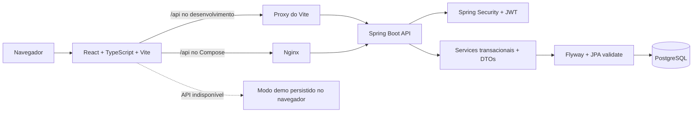

# PlaySpace — gestão de arenas e comunidade esportiva

PlaySpace é uma plataforma full-stack para operação de arenas esportivas e relacionamento entre jogadores. O projeto reúne reservas, agenda, quadras, pagamentos demonstrativos, campeonatos, comunidade, parceiros, avaliações, ranking, notificações e administração em uma experiência responsiva com dois perfis de acesso.

O sistema pode operar conectado à API Spring Boot e ao PostgreSQL ou em modo demonstração local, com os mesmos fluxos principais persistidos no navegador. A interface identifica claramente quando não existe backend conectado e nunca apresenta transações demonstrativas como pagamentos reais.


## Visão geral

- 27 rotas autenticadas: 13 administrativas, incluindo o index, e 14 de cliente, incluindo o index.
- Cadastro público de Cliente/Jogador e gestão administrativa de usuários.
- Temas claro e escuro persistentes, gráficos adaptáveis e identidade visual esportiva.
- Agenda diária, semanal e mensal, com filtros, criação por horário e detalhes da reserva.
- Reservas com conflito transacional, cálculo de valor, estados, histórico, pagamento e cancelamento.
- Comunidade com publicações, comentários, curtidas, edição, exclusão, paginação e compartilhamento.
- Campeonatos com CRUD administrativo, seis estados, filtros, participantes e inscrições.
- Perfil esportivo, disponibilidade semanal e fluxo completo de interesses entre parceiros.
- Perfil pessoal, preferências, troca de senha, avatar, histórico e resumo do jogador.
- Configurações operacionais persistentes e aplicadas às reservas e aos pagamentos.
- Avaliações protegidas por reserva concluída e unicidade por reserva.
- Ranking real por período e modalidade, com pontos, horas e conquistas.
- Busca global com debounce, resultados agrupados, teclado e fechamento por clique externo.
- Backend protegido por JWT, autorização por perfil, validação, transações e tratamento global de erros.
- Flyway como fonte do schema e dados demo idempotentes nos perfis `demo` e `test`.

## Experiência pública

- Landing page com apresentação do produto, benefícios, métricas demonstrativas, galeria de quadras, comunidade, campeonatos, depoimentos e FAQ.
- Login com atalhos para os dois perfis demo, exibir/ocultar senha, aviso de Caps Lock, loading e feedback de erro.
- Cadastro em `/cadastro` com nome, e-mail, telefone opcional, senha, confirmação e aceite dos termos.
- O cadastro público sempre cria um Cliente/Jogador e respeita a configuração `publicRegistrationEnabled`; nunca concede acesso administrativo.
- Páginas próprias para 403, 404, 500, offline e manutenção.

## Rotas administrativas


| Rota | Funcionalidades |
| --- | --- |
| `/admin` | KPIs, próximas reservas, receita e reservas da semana, modalidades, horários utilizados e atividades recentes normalizadas |
| `/admin/reservas` | Busca, filtros, paginação, criação, detalhes, timeline, pagamento, transições de status e cancelamento confirmado |
| `/admin/quadras` | CRUD, imagem por URL ou upload local no demo, status/manutenção, preço, capacidade, modalidade, cobertura e iluminação |
| `/admin/agenda` | Visões dia/semana/mês, filtros, navegação de período, legenda, criação por slot e detalhes |
| `/admin/pagamentos` | Busca, filtros, comprovante, status, PIX/cartões demo e estorno administrativo auditado |
| `/admin/comunidade` | Feed compartilhado, criação, edição, exclusão, curtidas, comentários, moderação e compartilhamento |
| `/admin/campeonatos` | CRUD, status, datas, modalidade, local/quadra, vagas, regulamento, premiação, participantes e inscrições |
| `/admin/usuarios` | Busca, filtros, criação, edição, perfil, ativação/inativação, redefinição de senha e detalhes operacionais |
| `/admin/relatorios` | Indicadores, impressão/PDF e exportações de dados |
| `/admin/configuracoes` | Empresa, funcionamento, reservas, preços, pagamentos, notificações, aparência e segurança |
| `/admin/perfil` | Dados pessoais, avatar, modalidades, biografia, disponibilidade, resumo, histórico e troca de senha |
| `/admin/preferencias` | Tema, notificações, cidade, modalidades, horários, privacidade e idioma |
| `/admin/status` | Estado técnico da aplicação sem exposição de segredos ou hosts internos |

## Rotas do cliente


| Rota | Funcionalidades |
| --- | --- |
| `/app` | Resumo esportivo, próximas reservas, conquistas e visão geral da conta |
| `/app/reservas` | Próximas partidas, histórico, detalhes, timeline, pagamento, cancelamento e avaliação de reservas concluídas |
| `/app/nova-reserva` | Fluxo guiado com disponibilidade, capacidade, cálculo automático e pagamento demo |
| `/app/quadras` | Busca, favoritos, estrutura, avaliação média, disponibilidade e preço |
| `/app/agenda` | Visões dia/semana/mês, horários por status e detalhes preservando dados de outros jogadores |
| `/app/pagamentos` | Histórico, filtros, detalhes, impressão e download de comprovante demonstrativo |
| `/app/perfil` | Perfil pessoal e esportivo, avatar, resumo, histórico e senha |
| `/app/preferencias` | Tema, notificações, lembretes, cidade, modalidades, horários e privacidade |
| `/app/estatisticas` | Reservas, horas, gastos, frequência e evolução esportiva |
| `/app/comunidade` | Publicações, comentários, curtidas e compartilhamento persistentes |
| `/app/ranking` | Classificação por semana, mês ou ano, modalidade, pontos, horas e conquistas |
| `/app/parceiros` | Perfil esportivo, múltiplas disponibilidades, busca e interesses enviados/recebidos |
| `/app/campeonatos` | Filtros, detalhes, regulamento, participantes, inscrição e cancelamento da inscrição |
| `/app/ai` | Assistente demonstrativo baseado em regras e nos dados internos da conta |

## Módulos funcionais

### Dashboard e gráficos

- Cards e gráficos usam alturas compactas, domínio mínimo coerente e dimensionamento responsivo.
- O gráfico “Reservas e receita da semana” mantém quantidade e receita em eixos separados, com tooltip em português e moeda em reais.
- Barras possuem largura máxima e espaçamento proporcional para poucos registros.
- Títulos, legendas e rótulos se adaptam ao tema e ao viewport.
- Estados vazios substituem áreas brancas quando não há dados.
- As atividades recentes são normalizadas em português brasileiro, com capitalização, datas e valores consistentes.

### Reservas, agenda e quadras

- Disponibilidade diária consultada na API sem expor identidade, preço ou observações de reservas de terceiros.
- Agenda com visões diária, semanal e mensal, navegação de períodos, filtros por quadra/modalidade e legenda por status.
- Criação de reserva por formulário ou seleção de slot, com código único, capacidade e valor calculado.
- Horário de funcionamento, dias operacionais, intervalo de slots, duração mínima e antecedência máxima vêm das configurações.
- Sobreposição protegida no serviço com lock pessimista da quadra e conflito transacional.
- Quadras possuem preço, capacidade, modalidade, cobertura, iluminação, status, imagem e avaliação média.

### Comunidade

- Listagem paginada e ordenada pelas publicações mais recentes.
- Criação, edição e exclusão de publicação própria; administrador pode moderar qualquer publicação.
- Curtir/descurtir idempotente, com contadores atualizados imediatamente.
- Comentários paginados, validação de conteúdo vazio, criação, edição e exclusão por autoria.
- Compartilhamento usa Web Share API quando disponível e clipboard com fallback quando não estiver.
- Autor, avatar, modalidade, data/hora, contadores e feedback de sucesso/erro são exibidos em cada publicação.

### Campeonatos

- Campos de nome, descrição, modalidade, cidade, local, quadra, datas, prazo, limite, valor, formato, premiação, regulamento e imagem opcional.
- Estados: Rascunho, Inscrições abertas, Inscrições encerradas, Em andamento, Concluído e Cancelado.
- CRUD e transições administrativas protegidos no backend.
- Filtros por modalidade, cidade, data e status.
- Inscrição e cancelamento pelo jogador, prevenção de duplicidade, limite de vagas e consulta de participantes.
- Seed idempotente com exemplos de inscrições abertas, evento futuro, em andamento e concluído.

### Parceiros

- Perfil esportivo com modalidade principal e secundárias, nível, cidade, regiões, objetivo, apresentação, posição, avatar e visibilidade.
- Disponibilidade com múltiplos dias e faixas de horário editáveis.
- Busca paginada por nome, cidade, modalidade, nível e objetivo.
- Interesse sem duplicidade, cancelamento, solicitações enviadas/recebidas, aceite e recusa.
- Estados Pendente, Aceito, Recusado e Cancelado; contato liberado após aceite.
- Atividade e notificação geradas nas mudanças relevantes.

### Perfil, preferências e usuários

- Perfil compartilhado entre os dois papéis, com nome, e-mail, telefone, cidade, avatar, nível, modalidades, biografia e disponibilidade.
- Resumo de reservas, avaliações e conquistas, além do histórico básico.
- Alteração de senha com validação da senha atual e regras de força.
- Preferências de tema, notificações, lembretes, e-mail, navegador, cidade, modalidades, horários, privacidade, descoberta por parceiros e idioma.
- Cadastro público e criação administrativa de usuários com autorização por perfil.
- Administração com busca, filtros, ativação/inativação, redefinição de senha e consulta de reservas e pagamentos.

### Pagamentos, avaliações e ranking

- PIX e cartão demonstrativos, com atualização automática da reserva após aprovação.
- Histórico, filtros, detalhes e comprovante demonstrativo em texto/impressão.
- Estorno permitido apenas ao administrador e somente para pagamento aprovado; a reserva vinculada é cancelada quando ainda não está concluída.
- Avaliação de 1 a 5 estrelas permitida apenas ao dono de uma reserva concluída e no máximo uma vez por reserva.
- Média por quadra calculada a partir das avaliações persistidas.
- Ranking filtrado por período (`WEEKLY`, `MONTHLY`, `ANNUAL`) e modalidade, com pontos por reservas, horas e conquistas desbloqueadas.

### Configurações

A área administrativa possui oito abas persistentes:

- Empresa: nome, razão social, documento, contato, endereço e fuso horário.
- Funcionamento: abertura, fechamento, dias e modalidades ativas.
- Reservas: cancelamento, duração mínima, antecedência e duração dos slots.
- Preços: valor base por modalidade.
- Pagamentos: métodos aceitos e chave PIX.
- Notificações: e-mail, navegador e antecedência do lembrete.
- Aparência: cor principal, logotipo e tema padrão.
- Segurança: tamanho/força de senha, duração da sessão e cadastro público.

Os valores são carregados da fonte ativa, validados, salvos e aplicados aos fluxos de reserva e pagamento.

## UX transversal e acessibilidade

- Sidebar recolhível no desktop, drawer no mobile e navegação inferior para ações frequentes.
- Badge discreto “Modo demo” na sidebar/drawer; o aviso completo aparece somente no primeiro acesso e pode ser reaberto.
- Menu de perfil funcional, fechado por Escape ou clique externo, com troca de conta demo e links para perfil/preferências.
- Busca global por quadras, reservas, pagamentos, usuários, campeonatos e parceiros, com debounce, grupos, teclado e estado vazio.
- Central de notificações com contador, leitura individual, marcar todas e navegação para o conteúdo relacionado.
- Modais em portal com foco inicial, focus trap, Escape, restauração de foco e bloqueio de scroll.
- Labels associados, foco visível, textos alternativos, regiões anunciadas e estados semânticos.
- Alvos de toque de pelo menos 44 px nas principais ações em tablet/mobile.
- Suporte a `prefers-reduced-motion` e contraste revisado nos temas claro e escuro.

## Arquitetura



O frontend tenta a API primeiro. O fallback local só é ativado diante de falha de infraestrutura/transporte; credenciais rejeitadas pela API não são aceitas pelo modo demo. Respostas assíncronas antigas não podem sobrescrever uma sessão mais recente.

## Modo conectado e modo demo

### Modo real

- Autenticação e autorização são processadas pela API.
- Dados operacionais são carregados do PostgreSQL e não são gravados como coleções no `localStorage`.
- Comunidade, comentários, curtidas, campeonatos, inscrições, perfis esportivos, interesses, perfil, preferências, configurações, avaliações, notificações, reservas e pagamentos demo usam endpoints reais.
- O badge de armazenamento local não é exibido.

### Modo demonstração local

- Ativado automaticamente quando a API está indisponível.
- Estado funcional persistido em `playspace-demo-state-v3`, com gravação debounced.
- Tema e sessão usam chaves separadas; trocar de conta não mistura coleções da API entre usuários.
- Criações, edições, curtidas, comentários, inscrições, interesses, perfil, preferências, avaliações, reservas e estornos permanecem após atualizar a página.
- O aviso completo aparece uma vez; depois permanece apenas o badge “Modo demo” com explicação acessível.
- PIX, cartão, comprovante e estorno não movimentam dinheiro real.

## Regras de negócio e segurança

- JWT stateless validado em todas as rotas protegidas, inclusive status ativo/bloqueado do usuário.
- 401 para ausência/falha de autenticação, 403 para autorização e 409 para conflitos de negócio.
- Usuário comum não cria administradores e não altera dados de outras contas.
- E-mail único sem diferenciar maiúsculas de minúsculas.
- Autoinativação e remoção do último administrador ativo são bloqueadas.
- Publicações e comentários respeitam autoria; o administrador possui permissão explícita de moderação.
- Interesse e inscrição duplicados são bloqueados no serviço e no banco quando aplicável.
- Reserva no passado, além da antecedência, fora do funcionamento, acima da capacidade ou em quadra indisponível é rejeitada.
- Valor da reserva é calculado no servidor conforme duração e preço da quadra.
- Estados ocupados não podem se sobrepor; criação concorrente usa lock pessimista.
- Cliente só cria, paga, cancela e avalia reservas próprias.
- Avaliação exige reserva concluída e possui restrição única por reserva.
- Aprovação duplicada e métodos desabilitados nas configurações são bloqueados.
- Estorno é administrativo, gera auditoria/notificação e registra `refundedAt`.
- Exclusão de quadra é lógica e preserva o histórico.
- Tratamento global fornece mensagens amigáveis e validação de payload.
- CORS, segredo JWT, credenciais e perfil ativo são configurados por ambiente.

## Stack

| Camada | Tecnologias |
| --- | --- |
| Frontend | React 18, TypeScript 5.7, Vite 6, React Router 7, Tailwind CSS 3, Recharts 3, Lucide |
| Backend | Java 21, Spring Boot 3.4, Spring Security, JWT/JJWT, Bean Validation, JPA/Hibernate |
| Dados | PostgreSQL 16, Flyway, H2 em modo PostgreSQL nos testes |
| Infra | Docker, Docker Compose, Nginx |
| Testes | Vitest 4, Testing Library, JUnit 5, Spring Boot Test e MockMvc |
| CI | GitHub Actions com Node 22 e Temurin 21 |

## Credenciais de demonstração

| Perfil | E-mail | Senha |
| --- | --- | --- |
| Administrador | `admin@playspace.com` | `Admin@123` |
| Cliente/Jogador | `cliente@playspace.com` | `Cliente@123` |

O seed backend é executado somente nos perfis `demo` e `test` e é idempotente.

## Execução com Docker

Pré-requisito: Docker Desktop com Docker Compose v2.

```powershell
Copy-Item .env.example .env
docker compose up --build
```

Em macOS/Linux:

```bash
cp .env.example .env
docker compose up --build
```

Acessos padrão:

- Frontend: <http://localhost:3002>
- API: <http://localhost:28080>
- Swagger: <http://localhost:28080/swagger-ui.html>
- PostgreSQL: acessível apenas na rede interna do Compose.

Antes de usar fora de uma demonstração local, altere `JWT_SECRET`, `POSTGRES_PASSWORD`, origens CORS e desative o perfil `demo`.

### Banco anterior ao Flyway

O baseline automático está desabilitado. Um banco não vazio sem `flyway_schema_history` falha de forma segura em vez de assumir um schema desconhecido.

Para recriar apenas um volume local descartável:

```powershell
# Atenção: remove todos os dados locais do Compose.
docker compose down -v
docker compose up --build
```

Para um banco com dados reais, crie um baseline auditado; não apague o volume.

## Execução manual

Pré-requisitos: Java 21, Maven 3.9+, Node.js 22 e PostgreSQL 16.

Backend em PowerShell:

```powershell
cd backend
$env:SPRING_PROFILES_ACTIVE = "demo"
$env:JWT_SECRET = "substitua-por-um-segredo-com-pelo-menos-32-bytes"
$env:SPRING_DATASOURCE_URL = "jdbc:postgresql://localhost:5432/playspace"
$env:SPRING_DATASOURCE_USERNAME = "playspace"
$env:SPRING_DATASOURCE_PASSWORD = "playspace"
mvn spring-boot:run
```

Frontend:

```powershell
cd frontend
npm ci
npm run dev
```

O Vite atende em <http://localhost:5173> e encaminha `/api` para <http://localhost:8080>.

## Variáveis de ambiente

| Variável | Uso | Padrão de demonstração |
| --- | --- | --- |
| `POSTGRES_DB` | Banco criado pelo Compose | `playspace` |
| `POSTGRES_USER` | Usuário PostgreSQL | `playspace` |
| `POSTGRES_PASSWORD` | Senha PostgreSQL | `playspace` |
| `SPRING_DATASOURCE_URL` | URL JDBC | Rede interna do Compose |
| `SPRING_DATASOURCE_USERNAME` | Usuário JDBC | `playspace` |
| `SPRING_DATASOURCE_PASSWORD` | Senha JDBC | `playspace` |
| `SPRING_PROFILES_ACTIVE` | Ativa dados demo | `demo` no Compose |
| `JWT_SECRET` | Chave HMAC obrigatória | Placeholder local; troque |
| `JWT_EXPIRATION_MINUTES` | Duração do token | `120` |
| `CORS_ALLOWED_ORIGINS` | Origens separadas por vírgula | Portas locais |
| `BACKEND_HOST_PORT` | Porta externa da API | `28080` |
| `FRONTEND_HOST_PORT` | Porta externa do Nginx | `3002` |
| `VITE_API_URL` | Base da API no frontend | `/api` |

## API por módulo

Todos os caminhos abaixo usam o prefixo `/api`.

### Autenticação e conta

| Método e caminho | Acesso | Uso |
| --- | --- | --- |
| `POST /auth/login` | Público | Login e emissão do JWT |
| `POST /auth/register` | Público, se habilitado | Cadastro exclusivo de Cliente/Jogador |
| `GET /auth/me` | Autenticado | Sessão atual |
| `GET /profile` / `PUT /profile` | Autenticado | Consultar e editar perfil |
| `DELETE /profile/avatar` | Autenticado | Remover avatar |
| `PUT /profile/password` | Autenticado | Trocar senha |
| `GET /profile/summary` | Autenticado | Resumo de reservas, avaliações e conquistas |
| `GET /profile/history` | Autenticado | Histórico básico |
| `GET /profile/preferences` / `PUT /profile/preferences` | Autenticado | Preferências persistentes |

### Usuários

| Método e caminho | Acesso | Uso |
| --- | --- | --- |
| `GET /users` / `GET /users/search` | Administrador | Listagem, busca e filtros |
| `GET /users/{id}` | Administrador | Detalhes |
| `GET /users/{id}/reservations` | Administrador | Reservas do usuário |
| `GET /users/{id}/payments` | Administrador | Pagamentos do usuário |
| `POST /users` | Administrador | Criar usuário |
| `PUT /users/{id}` | Administrador | Editar usuário/perfil |
| `PUT /users/{id}/status` | Administrador | Ativar ou inativar |
| `PUT /users/{id}/password` | Administrador | Redefinir senha |
| `DELETE /users/{id}` | Administrador | Inativação protegida |

### Quadras, reservas e pagamentos

| Método e caminho | Acesso | Uso |
| --- | --- | --- |
| `GET /courts` | Público | Listar quadras |
| `GET /courts/{id}` | Autenticado | Detalhar uma quadra |
| `POST /courts` / `PUT /courts/{id}` / `DELETE /courts/{id}` | Administrador | CRUD e arquivamento lógico |
| `GET /reservations/my` | Cliente | Reservas próprias |
| `GET /reservations/availability` | Autenticado | Disponibilidade sem dados privados |
| `POST /reservations` | Autenticado | Criar reserva |
| `PUT /reservations/{id}/cancel` | Dono/admin | Cancelar reserva |
| `GET /reservations` / `GET /reservations/week` | Administrador | Listagem e agenda operacional |
| `PUT /reservations/{id}/status/{status}` | Administrador | Transição de status |
| `GET /payments/my` | Cliente | Pagamentos próprios |
| `POST /payments/demo` | Autenticado | PIX/cartão demonstrativo |
| `GET /payments` | Administrador | Histórico global |
| `POST /payments/{id}/refund` | Administrador | Estorno demonstrativo auditado |

### Comunidade, avaliações e ranking

| Método e caminho | Acesso | Uso |
| --- | --- | --- |
| `GET /community/posts?page=&size=` | Autenticado | Feed paginado |
| `GET /community/posts/{id}` | Autenticado | Detalhes da publicação |
| `POST /community/posts` | Autenticado | Criar publicação |
| `PUT /community/posts/{id}` / `DELETE /community/posts/{id}` | Autor/admin | Editar ou excluir |
| `POST /community/posts/{id}/likes` / `DELETE /community/posts/{id}/likes` | Autenticado | Curtir/descurtir |
| `GET /community/posts/{id}/comments` | Autenticado | Comentários paginados |
| `POST /community/posts/{id}/comments` | Autenticado | Criar comentário |
| `PUT /community/comments/{id}` / `DELETE /community/comments/{id}` | Autor/admin | Editar ou excluir comentário |
| `GET /community/reviews` | Autenticado | Avaliações recentes |
| `POST /community/reviews` | Cliente | Avaliar reserva concluída |
| `GET /community/ranking?period=&modality=` | Autenticado | Ranking filtrado |
| `GET /community/achievements/my` | Autenticado | Conquistas da conta |

`GET /community/feed`, `POST|DELETE /community/feed/{id}/like`, `GET /community/partners`, `GET|POST /community/championships` e `POST /community/championships/{id}/enroll` permanecem como endpoints de compatibilidade para clientes anteriores. Os fluxos novos usam `/community/posts`, `/partners` e `/championships`.

### Campeonatos

| Método e caminho | Acesso | Uso |
| --- | --- | --- |
| `GET /championships` / `GET /championships/{id}` | Autenticado | Filtros, paginação e detalhes |
| `POST /championships` | Administrador | Criar campeonato |
| `PUT /championships/{id}` | Administrador | Editar campeonato |
| `PATCH /championships/{id}/status` | Administrador | Alterar estado |
| `DELETE /championships/{id}` | Administrador | Excluir quando permitido |
| `POST /championships/{id}/enrollments` | Cliente | Inscrever-se |
| `DELETE /championships/{id}/enrollments/my` | Cliente | Cancelar inscrição própria |
| `GET /championships/{id}/participants` | Autenticado | Participantes paginados |
| `GET /championships/enrollments/my` | Cliente | Inscrições próprias |

### Parceiros

| Método e caminho | Acesso | Uso |
| --- | --- | --- |
| `GET /partners/profiles/me` | Cliente | Perfil esportivo próprio |
| `PUT /partners/profiles/me` | Cliente | Salvar perfil e horários |
| `GET /partners` / `GET /partners/{userId}` | Cliente | Busca paginada e detalhes |
| `POST /partners/{userId}/interests` | Cliente | Enviar interesse sem duplicidade |
| `GET /partner-interests?direction=&status=` | Cliente | Solicitações enviadas/recebidas |
| `PATCH /partner-interests/{id}/accept` | Destinatário | Aceitar interesse |
| `PATCH /partner-interests/{id}/refuse` | Destinatário | Recusar interesse |
| `DELETE /partner-interests/{id}` | Remetente | Cancelar interesse |

### Configurações, notificações e relatórios

| Método e caminho | Acesso | Uso |
| --- | --- | --- |
| `GET /settings` / `PUT /settings` | Administrador | Configuração completa da plataforma |
| `GET /notifications` | Autenticado | Listagem da conta |
| `GET /notifications/unread-count` | Autenticado | Contador de não lidas |
| `PUT /notifications/{id}/read` | Dono | Marcar como lida |
| `DELETE /notifications` | Autenticado | Limpar notificações próprias |
| `GET /dashboard/admin` / `GET /dashboard/client` | Por perfil | Dashboards calculados |
| `GET /reports` | Administrador | Resumo gerencial |
| `GET /reports/export/pdf` / `GET /reports/export/excel` | Administrador | Exportações |
| `POST /ai/ask` | Autenticado | Assistente interno demonstrativo |
| `GET /status` | Autenticado | Estado técnico seguro |

Swagger/OpenAPI fica disponível em `/swagger-ui.html` e `/v3/api-docs/**`.

## Migrations e persistência

| Migration | Conteúdo |
| --- | --- |
| `V1__initial_schema.sql` | Schema base: usuários, quadras, reservas, pagamentos, notificações, auditoria e domínios legados |
| `V2__community_interactions.sql` | Modalidade em publicação, comentários e curtidas com unicidade |
| `V3__accounts_settings_championships_partners.sql` | Perfil/preferências, configurações, campeonatos, inscrições, perfil esportivo, disponibilidades e interesses |
| `V4__review_uniqueness.sql` | Vínculo da avaliação à reserva e prevenção de avaliação duplicada |
| `V5__payment_refund_timestamp.sql` | Data/hora de estorno em pagamentos |

Hibernate opera com `ddl-auto=validate`; nenhuma entidade altera o schema fora das migrations. Os seeders verificam registros existentes antes de criar dados e não duplicam conteúdo a cada inicialização.

## Como validar os principais fluxos

### Comunidade

1. Entre como cliente e abra `/app/comunidade`.
2. Crie uma publicação, edite-a e teste curtir/descurtir.
3. Abra comentários, valide o bloqueio do conteúdo vazio, crie, edite e exclua um comentário.
4. Use Compartilhar; o navegador usa Web Share ou copia o conteúdo/link.
5. Atualize a página e confirme a persistência.
6. Entre como administrador para validar a moderação de conteúdo de terceiros.

### Campeonatos

1. Como administrador, abra `/admin/campeonatos`, crie um rascunho e edite os campos.
2. Abra inscrições, acompanhe participantes e altere os estados permitidos.
3. Como cliente, filtre eventos, abra os detalhes e inscreva-se.
4. Repita a inscrição para confirmar o bloqueio de duplicidade e depois cancele quando permitido.

### Parceiros

1. Como cliente, abra `/app/parceiros` e edite “Meu perfil esportivo”.
2. Adicione modalidades, níveis e múltiplas faixas de disponibilidade.
3. Busque outro jogador, envie interesse e confirme o bloqueio de duplicidade.
4. Troque para a conta destinatária, aceite ou recuse; teste também o cancelamento pelo remetente.

### Perfil, preferências e usuários

1. Abra Perfil pelo menu, edite dados/avatar, salve e atualize a página.
2. Troque a senha e valide a senha antiga.
3. Em Preferências, altere tema, notificações, cidade, horários e privacidade; recarregue.
4. Use `/cadastro` para criar uma conta pública e confirme que ela recebe somente o papel Cliente/Jogador.
5. Como administrador, crie, edite, inative e reative um usuário em `/admin/usuarios`.

### Reservas, pagamentos e avaliações

1. Como cliente, selecione uma quadra, data e horário em `/app/nova-reserva`.
2. Conclua o PIX/cartão demo e confirme a mudança da reserva para Confirmada.
3. Abra os detalhes, histórico e comprovante.
4. Como administrador, filtre o pagamento e teste o estorno; a reserva aberta vinculada é cancelada.
5. Para uma reserva Concluída do cliente, envie uma avaliação e confirme que uma segunda avaliação é bloqueada.

## Qualidade e validação

Comandos usados pelos gates locais e pela integração contínua:

```powershell
cd frontend
npm run test:run
npm run build
npm audit --audit-level=low

cd ..\backend
mvn test
mvn package

cd ..
docker compose config --quiet
docker compose build
```

Resultados da validação final:

- Frontend: 9/9 arquivos e 32/32 testes Vitest/Testing Library aprovados, sem warnings. A cobertura inclui API, sessão, disponibilidade, agenda configurável, imagens, comunidade, campeonatos, parceiros, perfil, preferências, avaliações e estorno.
- Build frontend: `tsc -b && vite build` concluído sem warnings com Vite 6.4.3, 2.200 módulos e diretório `dist` gerado.
- Backend: 9/9 classes e 40/40 testes JUnit/MockMvc aprovados, sem falhas, erros ou testes ignorados. A suíte cobre autenticação, cadastro, autorização, regras de reserva, concorrência, comunidade, campeonatos, parceiros, avaliações, pagamentos/estorno, auditoria e migrations até V5.
- Build backend: `mvn package -q -DskipTests` concluído e `backend/target/playspace-api-1.0.0.jar` gerado.
- Auditoria npm: zero vulnerabilidades conhecidas.
- `docker compose config --quiet`: configuração válida.
- Docker: `docker compose build --progress=plain` concluído com as imagens `projetoreservadequadras-backend:latest` e `projetoreservadequadras-frontend:latest`.
- Todos os gates finalizaram com código de saída zero.
- O workflow em `.github/workflows/quality.yml` reproduz testes/build do frontend, testes do backend e validação/build do Compose.

## Auditoria visual e responsividade

A revisão visual final cobriu todas as páginas nos seguintes viewports:

- Mobile: 360 px, 390 px e 414 px.
- Tablet: 768 px.
- Notebook: 1366 px.
- Desktop Full HD: 1920 px.

Foram verificadas 210 combinações completas de rota/viewport — 78 administrativas, 84 do cliente e 48 públicas/sistema — mais 9 checagens focadas em mobile, totalizando 219 cenários visuais. A matriz cobriu overflow horizontal, sobreposição, alinhamento, espaçamento, contraste, modais, dropdowns, tabelas/cards responsivos, calendários, gráficos, estados vazios, foco, alvos de toque e console. Não foram observados erros de console nas matrizes PlaySpace.

## Performance

- Páginas públicas, administrativas e do cliente são carregadas sob demanda com `React.lazy`.
- Vite produz chunks separados para React, gráficos, ícones e áreas funcionais.
- Busca global usa debounce; persistência demo usa gravação debounced.
- Dados demo não são recriados a cada render e coleções derivadas usam memoização onde há ganho real.
- Imagens locais estão em WebP, com lazy loading, recorte consistente e fallback seguro.
- Assets versionados recebem cache imutável no Nginx.
- Listagens grandes usam paginação no backend e controles responsivos no frontend.

## Estrutura

```text
.
├── .github/workflows/quality.yml
├── backend
│   ├── src/main/java/com/playspace/api
│   ├── src/main/resources/db/migration
│   └── src/test
├── docs
│   ├── IMPLEMENTATION_REPORT.md
│   └── screenshots
├── frontend
│   ├── src/assets
│   ├── src/components
│   ├── src/contexts
│   ├── src/features
│   ├── src/lib
│   └── src/test
├── .env.example
└── docker-compose.yml
```

## Limitações externas conhecidas

As funcionalidades internas descritas acima estão implementadas. Os itens abaixo dependem de serviços externos e permanecem deliberadamente demonstrativos:

- Não existe gateway de pagamento homologado; PIX, cartão, comprovante e estorno não movimentam dinheiro real.
- O clima é simulado e identificado como tal; não há integração com provedor meteorológico.
- O assistente usa regras e dados internos; não há modelo de IA externo configurado.
- Avatares e imagens no modo conectado usam URL pública; não há object storage nem pipeline de upload binário no backend.
- Não há refresh token, revogação centralizada, recuperação de senha por e-mail ou rate limiting distribuído.
- Notificações persistem dentro do produto, mas não enviam push/e-mail reais sem provedores externos.
- O JWT fica no `localStorage` para a demonstração SPA; um ambiente de maior risco deve preferir BFF/cookie HttpOnly, rotação e proteção adicional contra XSS.
- A concorrência automatizada usa H2 em modo PostgreSQL; teste de carga dedicado em PostgreSQL real deve integrar o plano de produção.

## Preparação para produção

O Compose entrega frontend Nginx, API e PostgreSQL. Para publicar em produção:

1. use um gerenciador de segredos e troque todas as credenciais padrão;
2. remova o perfil `demo` e configure domínio, TLS e `CORS_ALLOWED_ORIGINS`;
3. use PostgreSQL gerenciado ou volume com backup e restauração testados;
4. configure object storage, gateway, e-mail/push e observabilidade conforme a operação;
5. adicione refresh/revogação de sessão e rate limiting de borda;
6. execute todos os gates de CI antes de publicar.

Nenhum domínio ou pipeline externo de produção é inventado neste repositório. O relatório detalhado da implementação está em [docs/IMPLEMENTATION_REPORT.md](docs/IMPLEMENTATION_REPORT.md).
